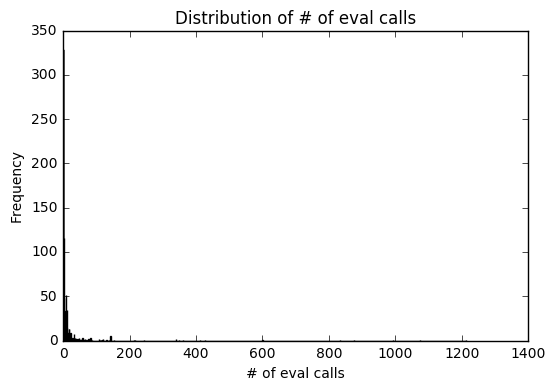
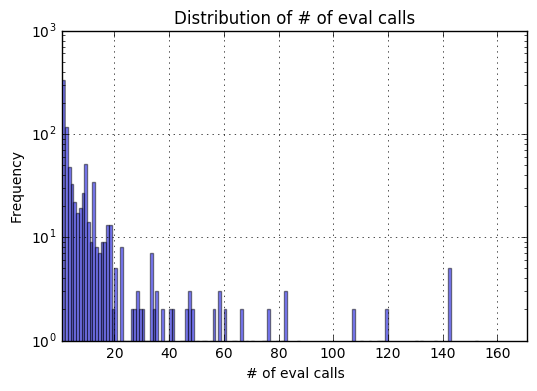
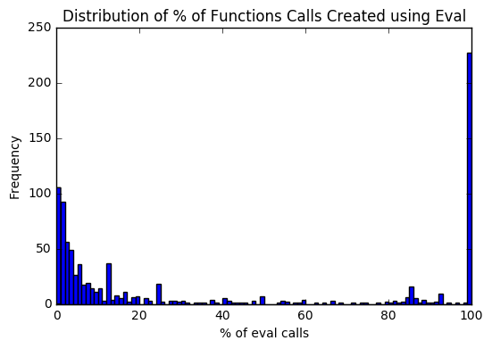
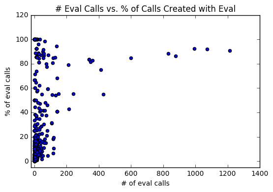

# Eval and Function Analysis

This notebook looks at 8 aspects of the "script_loc_eval" row in the crawl dataset:
1. How many websites, and what % of websites, use eval 1 or more times.
2. For all the websites that use eval 1 or more times, How many times is eval used by these website and what % of total function calls are eval calls.
3. The number of unique scripts that use eval.
4. Out of the scripts on websites that use eval, how many scripts are 3rd party scripts.
5. Summary statistics about the # of eval calls per website.
6. A visualization of the distribution of the # of eval calls.
7. A visualization of the distribution of the % of function calls for a website that are created using eval.
8. A visualization of the relationship between the # of eval calls and the % of function calls that are created using eval.


```python
import sys
sys.path.append('..')

import matplotlib.pyplot as plt
import pandas as pd

from utils import load_data_util

%matplotlib inline
```


```python
files_to_analyze = 10000
data = load_data_util.load_random_data(files_to_analyze, False, 42, False)
```

#### Build a dictionary with webpage urls as keys and eval information as the values.


```python
result = {}
for index, row in data.iterrows():
    # get the url of the webpage that was being crawled and use that as a unique key.
    key = row['location']

    if key not in result:
        result[key] = {
            "count": 0,
            "total_func_calls": 0,
            "script_urls": {}
        }

    if row['script_loc_eval'] != "":
        result[key]["count"] += 1
        
        script_url = row['script_url']
        result[key]["script_urls"][script_url] = result[key]["script_urls"].get(script_url, 1) + 1
    result[key]["total_func_calls"] += 1
```

### Analyze the collected data to get:
* The number of websites with atleast 1 eval call.
* The number of scripts that use eval and are not hosted on the same domain as the website calling that script.
* A list with all the scripts that have functions created using eval.
* A DataFrame with the url for websites that have 1 or more function created using eval. The DataFrame contains the # of eval calls for that website and the % of function calls that were created using eval.


```python
websites_with_eval_calls = 0
external_script_count = 0
script_urls = []
eval_usage = pd.DataFrame(columns=['url', '# of eval calls', '% of eval calls'])

for key in result:
    if result[key]['count'] > 0:
        websites_with_eval_calls += 1
        
        eval_call_count = result[key]['count']
        eval_call_percent = round(result[key]['count'] / result[key]['total_func_calls'] * 100, 2)
        
        eval_usage = eval_usage.append({
            "url": key,
            "# of eval calls": eval_call_count,
            "% of eval calls": eval_call_percent
        }, ignore_index=True)
        
        for script_url in result[key]["script_urls"]:
            script_urls.append(script_url)
            
            location_base_url = key.split("://")[1].split("/")[0]
            script_base_url = script_url.split("://")[1].split("/")[0]
            
            if location_base_url != script_base_url:
                external_script_count += 1

# set '# of eval calls' to be int type since it was being set to object type.
# without this change later analysis and visualizations do not work.
eval_usage['# of eval calls'] = eval_usage['# of eval calls'].astype("int")
```

#### Display how many websites have 1 or more function created using eval and what % of total websites have functions create using eval.


```python
percentage_of_websites_with_eval_calls = round(websites_with_eval_calls / files_to_analyze * 100, 2)

print(
    str(percentage_of_websites_with_eval_calls) + "% (" + 
    str(websites_with_eval_calls) + "/" + str(files_to_analyze) + 
    ") of websites have 1 or more function that is created using eval."
)
```

    8.98% (898/10000) of websites have 1 or more function that is created using eval.
    

#### Display the number of eval calls and % of function calls that are created using eval for all the websites with 1 or more eval calls.


```python
print(eval_usage.sort_values(by=['# of eval calls'], ascending=False))
```

                                                       url  # of eval calls  % of eval calls
    774        https://www.rezultati.com/nogomet/portugal/             1213            90.66
    585  https://www.flashscore.pl/pilka-nozna/honduras...             1074            91.95
    891  https://www.canliskor3.com/futbol/avrupa/sampi...              994            92.47
    655  https://www.flashscore.com/soccer/netherlands/...              876            86.48
    545  https://www.mismarcadores.com/futbol/espana/la...              833            88.43
    241         https://www.soccerstand.com/soccer/uganda/              600            84.63
    360    http://www.marksandspencer.com/l/lingerie/socks              427            54.95
    33   https://particuliers.lcl.fr/quotidien/gestion-...              412            74.91
    646          https://www.myscore.com.ua/football/peru/              360            82.57
    510           https://www.flashscore.com/soccer/world/              348            81.50
    1      https://www.meusresultados.com/futebol/turquia/              340            83.33
    110     https://www.flashscore.pl/pilka-nozna/boliwia/              340            83.33
    660  https://www.westpac.com.au/about-westpac/200-y...              243            55.23
    571              http://www.gameinformer.com/news.aspx              216            42.86
    83                       https://review.rakuten.co.jp/              213            79.18
    560            https://www.rd.com/advice/saving-money/              152            55.47
    280  http://www.thinkgeek.com/electronics-gadgets/m...              142            40.69
    741        http://www.thinkgeek.com/interests/tolkien/              142            40.69
    329   https://www.smbc-card.com/nyukai/card/ginren.jsp              142            68.27
    633              http://www.thinkgeek.com/accessories/              142            40.69
    351  http://www.thinkgeek.com/accessories/jewelry/b...              142            40.69
    143  https://newsroom.mastercard.com/asia-pacific/p...              137            94.48
    350  https://webbroker.td.com/waw/idp/login.htm?exe...              132            53.88
    709  http://www.japannetbank.co.jp/help/index.html?...              130            84.97
    734  https://www.snapdeal.com/products/home-furnish...              119            19.29
    460                   https://www.newyorker.com/latest              119            10.60
    470      https://www.hobbyconsolas.com/entretenimiento              118            84.89
    160  https://www.snapdeal.com/products/led-bulbs?so...              117            18.08
    573  http://www.topshop.com/en/tsuk/category/bags-a...              116             6.33
    428             https://ryohin-keikaku.jp/?area=footer              113            80.71
    ..                                                 ...              ...              ...
    577  https://googleads.g.doubleclick.net/pagead/ads...                1           100.00
    293  https://tpc.googlesyndication.com/sadbundle/$c...                1           100.00
    575  https://googleads.g.doubleclick.net/pagead/ads...                1            25.00
    574               http://www.motortrend.com/cars/ford/                1            12.50
    296  https://googleads.g.doubleclick.net/pagead/ads...                1           100.00
    598  https://googleads.g.doubleclick.net/pagead/ads...                1           100.00
    281  https://googleads.g.doubleclick.net/pagead/ads...                1           100.00
    635  https://googleads.g.doubleclick.net/pagead/ads...                1           100.00
    264       http://www.99kubo.com/vod-read-id-74008.html                1            25.00
    249  https://googleads.g.doubleclick.net/pagead/ads...                1           100.00
    250                  http://www.mts.ru/dom/sputnik_tv/                1            16.67
    252                      http://acfun.cn/login/forgot/                1             1.25
    630  https://googleads.g.doubleclick.net/pagead/ads...                1            25.00
    254  https://googleads.g.doubleclick.net/pagead/ads...                1           100.00
    625  http://rutrk.org/iframe/MG-2/MG-bottom.html?rn...                1             5.88
    624  https://googleads.g.doubleclick.net/pagead/ads...                1            25.00
    623                     http://www.yesky.com/20171111/                1             1.28
    262  https://tpc.googlesyndication.com/sadbundle/$c...                1           100.00
    618  http://moskva.beeline.ru/customers/products/mo...                1             1.85
    603  https://list.tmall.com/search_product.htm?acm=...                1             0.99
    617  https://googleads.g.doubleclick.net/pagead/ads...                1           100.00
    265  https://googleads.g.doubleclick.net/pagead/htm...                1           100.00
    267  https://googleads.g.doubleclick.net/pagead/ads...                1           100.00
    272  https://list.tmall.com/search_product.htm?abbu...                1             0.92
    273     https://www.lesechos.fr/sport/tennis/index.php                1             0.32
    609  https://www.bonanza.com/items/search?q%5Bfilte...                1             1.10
    607  https://googleads.g.doubleclick.net/pagead/ren...                1           100.00
    275  https://googleads.g.doubleclick.net/pagead/ads...                1           100.00
    604                https://www.focus.de/digital/handy/                1             0.10
    0    https://googleads.g.doubleclick.net/pagead/ads...                1           100.00
    
    [898 rows x 3 columns]
    

#### Display the number of unique scripts that call a function created using eval.


```python
total_script_urls = len(script_urls)
unique_script_urls = len(set(script_urls))
percentage_of_unique_script_urls = round(unique_script_urls / total_script_urls * 100, 2)

print(
    str(percentage_of_unique_script_urls) + "% (" + 
    str(unique_script_urls) + "/" + str(total_script_urls) + 
    ") of the scripts that use eval are unique."
)
```

    55.3% (558/1009) of the scripts that use eval are unique.
    

#### Display the number of scripts that are hosted on a 3rd parties domain.


```python
percentage_of_external_scripts = round(external_script_count / total_script_urls * 100, 2)

print(
    str(percentage_of_external_scripts) + "% (" + 
    str(external_script_count) + "/" + str(total_script_urls) + 
    ") of scripts that use eval are hosted on a different domain than the source website."
)
```

    72.75% (734/1009) of scripts that use eval are hosted on a different domain than the source website.
    

#### Print summary statistics for # of eval calls


```python
standard_deviation = round(eval_usage['# of eval calls'].std(), 2)
mean = round(eval_usage['# of eval calls'].mean(), 2)
median = round(eval_usage['# of eval calls'].median(), 2)

print('median = ' + str(median))
print('standard deviation = ' + str(standard_deviation))
print('average = ' + str(mean))
```

    median = 3.0
    standard deviation = 85.62
    average = 19.97
    

#### Visualize how many websites have a given number of eval calls.


```python
largest_eval_call_count = eval_usage['# of eval calls'].max()
plt.figure()

fig = eval_usage['# of eval calls'].plot.hist(bins=largest_eval_call_count)

plt.title("Distribution of # of eval calls")
fig.set_xlabel("# of eval calls")

plt.show()
plt.close()
```





Since the number of eval calls are so spread out, we cannot see much from the above graph other than that the majority of websites have a low number of eval calls.  Thus, to better visualize the data, we create a second histogram that looks at the frequency of websites where the number of eval calls is 2 standard deviations above 0. Since a large number of websites only have 1 eval call, we use a log scale so that all the data can be seen.


```python
plt.figure()

fig = eval_usage['# of eval calls'].plot.hist(alpha=0.5, bins=largest_eval_call_count)

plt.title("Distribution of # of eval calls")
fig.set_xlabel("# of eval calls")
plt.yscale('log')
fig.set_xlim(1, int(standard_deviation * 2))
fig.grid()

plt.show()
plt.close()
```





Since the standard deviation is large we look at the first 1/4th of a standard deviation of eval calls to better visualize the histogram bins.


```python
plt.figure()

fig = eval_usage['# of eval calls'].plot.hist(alpha=0.5, bins=largest_eval_call_count)

plt.title("Distribution of # of eval calls")
fig.set_xlabel("# of eval calls")
fig.set_xlim(1, int(standard_deviation / 4))
fig.grid();

plt.show()
plt.close()
```


#### Visualize the distribution of the % of function calls, created using eval, that the websites make.


```python
plt.figure()

fig = eval_usage['% of eval calls'].plot.hist(bins=100)

plt.title("Distribution of % of Functions Calls Created using Eval")
fig.set_xlabel("% of eval calls")

plt.show()
plt.close()
```





#### Visualize the relationship between the number of eval calls and the % of functions on the website that are created using eval.


```python
plt.figure()

fig = eval_usage.plot.scatter(x='# of eval calls', y='% of eval calls');

plt.title("# Eval Calls vs. % of Calls Created with Eval")
# set the x and y bounds so that they are slightly less than 1 so that the dots can be seen better.
fig.set_xlim(-20)
fig.set_ylim(-5)

plt.show()
plt.close()
```


    <matplotlib.figure.Figure at 0x29369e75c88>




